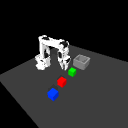
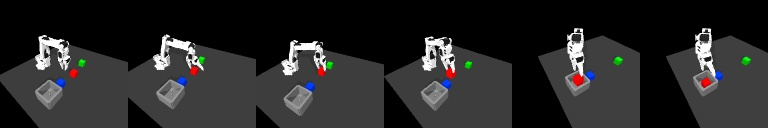

# Hierarchical MiniVLA for SO-101

A simulation-first research project for language-conditioned, multi-task robotic manipulation. The long-term question is whether explicit skill phases improve data efficiency and generalization over a flat vision-language-action policy.

## Current milestone: frozen-policy evaluation on unseen layouts and language

The final Hierarchical MiniVLA is evaluated once on nine new randomized layouts
(seeds 1900-1908), three colors, and three sentence templates absent from
training. It completes one blue pick-and-place episode end to end, for **1/9
(11.1%) success**. Eight episodes issue a close command, but only the successful
episode physically lifts and aligns the target cube.

The 1/9 result is reported without another DAgger round. It demonstrates one
genuine RGB-language-proprioception closed loop while exposing limited visual
target localization and unsafe phase termination under distribution shift. The
repository keeps the fixed protocol, complete JSON trace, negative results, and
training history so the claim remains reproducible rather than selectively
showing the successful seed.

## Results at a glance

| Frozen-policy evaluation | Result |
|---|---:|
| Unseen layouts | 9 |
| Unseen instruction templates | 3 |
| Colors | red / green / blue |
| End-to-end successes | **1/9 (11.1%)** |
| Episodes issuing close command | 8/9 |
| Episodes physically lifting cube | 1/9 |
| Offline phase accuracy | 95.51% |
| Offline autonomous action MAE | 0.489 mm |

<p align="center">
  
</p>

<p align="center"><em>Selected successful rollout: unseen seed 1902 and the unseen instruction “Place the blue object in the container.” Overall frozen-policy performance is 1/9.</em></p>

Milestone 0 began with the smallest useful symbolic contract:

```text
robot state + three cube positions + one-hot goal + bin position -> action
```

That early ridge-regression baseline passed five tests and reached a held-out
synthetic action MSE of `3.42e-16`. The upstream scene also loaded under MuJoCo
3.11, exposed six arm joints and nine cube-position values, and advanced one
physics step. The repository preserves that baseline alongside the physically
executed expert, learned state policies, DAgger experiments, RGB collector, and
current visual-language policy.

## Quick start

Create an environment and install this repository:

```bash
python3.12 -m venv .venv
source .venv/bin/activate
python -m pip install -e '.[learn]'
python -m unittest discover -s tests -v
python scripts/smoke_baseline.py
```

To check the upstream multicube simulator, first obtain the ETH course repository, install the optional simulation dependency, and pass the local HW3 path explicitly:

```bash
python -m pip install -e '.[sim,demo]'
python scripts/smoke_eth_env.py \
  --eth-hw3 /path/to/ethz-course-2026/hw3_imitation_learning
```

Add `--render` when a working OpenGL display is available.
Without that flag, the script intentionally skips renderer creation and checks
only XML loading, state initialization, and physics stepping. This makes the
check usable in headless terminals such as CI.

## Why the baseline has a goal-aware feature

The task goal is a one-hot vector for red, green, or blue. Selecting the corresponding cube position is a multiplicative interaction between a goal bit and a position. A plain linear model over the raw state cannot represent that interaction. `featurize` exposes the selected target explicitly, allowing the small baseline to verify the data and conditioning path before we introduce a neural network.

The synthetic scripted expert moves toward the selected cube while the gripper is open and toward the bin while it is holding an object. It is only a supervised-learning smoke test, not a replacement for MuJoCo demonstrations.

## Roadmap

- [x] Goal-conditioned data contract and runnable BC smoke baseline
- [x] Upstream multicube environment smoke-test entry point
- [x] Record or generate MuJoCo multicube demonstrations
- [x] Train a neural state + one-hot goal baseline on real simulation data
- [x] Compare flat and hierarchical state policies
- [x] Expand to recovery-augmented 120-episode data
- [x] Aggregate on-policy DAgger corrections (round 1)
- [x] Run DAgger round 2 from the updated policy
- [x] Target the descend-to-grasp boundary in DAgger round 3
- [x] Extend on-policy aggregation through grasp and lift
- [x] Aggregate on-policy transport and alignment failures
- [x] Define and headless-test the frame-aligned RGB-language data contract
- [x] Verify one real rendered RGB episode in a foreground macOS terminal
- [x] Select final camera framing from angle/top/front_close previews
- [x] Overfit one real RGB-language-proprioception batch end to end
- [x] Add RGB observations and natural-language goals (Flat MiniVLA)
- [x] Evaluate and diagnose Flat MiniVLA in closed-loop MuJoCo rollouts
- [x] Add phase supervision and phase-conditioned Hierarchical MiniVLA heads
- [x] Overfit one real phase-balanced Hierarchical MiniVLA batch
- [x] Train and evaluate Hierarchical MiniVLA on complete held-out episodes
- [x] Diagnose Hierarchical MiniVLA on a seen closed-loop layout
- [x] Add RGB recovery demonstrations for off-trajectory correction
- [x] Aggregate policy-visited RGB corrections with visual DAgger round 1
- [x] Target the visual reach-to-descend boundary in DAgger round 2
- [x] Add history-aware skill termination and complete a seen visual rollout
- [x] Run the first three-color unseen-layout closed-loop smoke test
- [x] Aggregate Visual DAgger corrections from failed layouts
- [x] Compare full-trajectory and correction-only DAgger sampling
- [x] Collect the final green/blue corrections and freeze the visual policy
- [x] Evaluate unseen layouts and instruction paraphrases
- [x] Package the frozen checkpoint, complete results, and success GIF

## Upstream attribution and licensing boundary

This project is inspired by and interoperates with [ETH Zurich's Robot Learning course repository](https://github.com/mees-robot-learning-course/ethz-course-2026), specifically `hw3_imitation_learning` and its SO-101 multicube MuJoCo scene.

The course repository did not declare a repository-level license when inspected on 2 August 2026. Therefore, this repository does not copy or redistribute the course homework code, autograder, or scene assets. The smoke script loads a separately obtained local checkout. The robot mesh subdirectory in the upstream repository includes its own license; users must still review upstream terms before redistribution.

All code authored in this repository is released under the MIT License.

## Milestone 1: physically executed scripted expert

The first real MuJoCo demonstration now uses a deterministic finite-state
controller instead of synthetic labels:

```text
reach -> descend -> grasp -> lift -> transport -> release
```

The expert controls the existing mocap end-effector target and the physical jaw
actuator in ETH's fixed multicube scene. The cube is never attached or moved by
editing its state. During a successful grasp, the jaw stops near `0.32 rad`
instead of reaching its closed limit, showing that the cube is held by contact.
Success additionally requires the jaw to be open after the cube settles in the
bin.

Run the collector with a separately obtained ETH HW3 checkout:

```bash
python scripts/collect_scripted_demo.py \
  --eth-hw3 /path/to/ethz-course-2026/hw3_imitation_learning \
  --output data/scripted/red_fixed_seed0.npz
```

The compressed trajectory contains aligned observations and commands:

```text
state_ee_xyz, state_joints, state_gripper
cubes_xyz, cubes, state_goal, goal_pos
action_ee_xyz, action_gripper
phase, phase_names
```

In the verified fixed-layout episode, the red cube was physically grasped,
lifted, transported, released, and remained inside the bin after settling. This
milestone proves the classical-control-to-demonstration part of the pipeline;
randomized layouts and learned policies remain future work.

Verification was repeated three times from a fresh reset. Every run succeeded
in 273 control steps with a grasp contact angle of `0.3255 rad`; the final cube
center was `[-0.1959, 0.6890, 0.0233]` for a bin centered at
`[-0.2000, 0.7000, 0.0210]`. All ten temporal arrays in each saved trajectory
have the same length, and the complete project test suite contains eight passing
tests.

## Milestone 2: randomized multi-goal dataset

The same physical expert now runs on shuffled layouts with Gaussian position
noise and cycles through red, green, and blue goal conditions. A batch
collector saves only successful trajectories for behavior cloning and writes a
`manifest.json` containing every attempted seed, including final cube and bin
positions for failures.

Collect the default 20-episode validation set with:

```bash
python scripts/collect_scripted_dataset.py \
  --eth-hw3 /path/to/ethz-course-2026/hw3_imitation_learning \
  --output-dir data/scripted/randomized \
  --episodes 20
```

The command exits unsuccessfully when fewer than 90% of attempts work, so it can
also serve as a reproducible regression check. Failed attempts are documented in
the manifest but are not added to the training trajectories.

On 2 August 2026, seeds 0 through 19 achieved 19/20 successful physical
pick-and-place episodes (95%) and produced 4,203 aligned state-action pairs
while cycling through all three goal colors. Seed
18 was the only failure: the red cube remained near the gripper at a height of
approximately 8.2 cm after the release phase. This gives us a real randomized
MuJoCo dataset for the next milestone: a learned neural state-and-goal policy.

## Milestone 3: learned state-and-goal baseline

The first learned MuJoCo policy is a two-layer MLP. It receives robot state,
all cube positions, the one-hot task goal, and the bin position. As in the
linear smoke baseline, the input also makes goal selection explicit by adding
the selected cube position and relative target/bin geometry. The policy
regresses a bounded Cartesian delta and classifies the gripper as open or
closed.

Install the learning dependency, train, and evaluate with:

```bash
python -m pip install -e '.[learn,sim]'

python scripts/train_state_policy.py \
  --data-dir data/scripted/randomized \
  --output checkpoints/state_goal_policy.pt \
  --metrics-output results/state_policy_offline.json

python scripts/evaluate_state_policy.py \
  --eth-hw3 /path/to/ethz-course-2026/hw3_imitation_learning \
  --checkpoint checkpoints/state_goal_policy.pt \
  --episodes 10 \
  --seed-start 100 \
  --output results/state_policy_unseen.json
```

The split is performed by whole episode, rather than by randomly mixing adjacent
timesteps. Fifteen episodes (3,248 steps) were used for training and four
episodes (955 steps) for validation. Early stopping selected epoch 31.

| Metric | Result |
|---|---:|
| Validation Cartesian MAE | 0.766 mm |
| Validation gripper accuracy | 98.95% |
| Closed loop, collected seeds 0-9 | 0/10 |
| Closed loop, unseen seeds 100-109 | 0/10 |

The zero closed-loop success rate is retained as a negative baseline, not hidden
behind the strong offline metrics. The learned controller frequently grasps and
lifts the correct cube, but does not reliably transition from lifting to
transport and release. Small one-step errors compound until the state leaves the
demonstration distribution. A conservative workspace bound prevents these
errors from driving the MuJoCo mocap target into numerically unsafe regions.

This failure identifies the next concrete research question: whether explicit
phase supervision can resolve the long-horizon ambiguity that the flat policy
cannot. The existing demonstrations already contain reach, descend, grasp,
lift, transport, and release labels, so the next comparison can hold the data
and network size fixed while changing only the policy structure. Exact metrics
and per-seed outcomes are stored under `results/`.

## Milestone 4: hierarchical state-policy diagnostic

The hierarchical policy keeps the same 34-dimensional state-and-goal input and
two-layer 128-unit encoder. It adds a weighted six-class phase head and six
phase-specific action heads:

```text
state + one-hot goal -> shared encoder -> phase prediction
                                    \-> phase-specific action
```

At deployment, a monotonic tracker requires repeated evidence for exactly the
next phase, so the learned controller cannot move backward or skip manipulation
stages. Training and evaluation commands are:

```bash
python scripts/train_hierarchical_state_policy.py \
  --data-dir data/scripted/randomized \
  --output checkpoints/hierarchical_state_policy.pt \
  --metrics-output results/hierarchical_state_offline.json

python scripts/evaluate_hierarchical_state_policy.py \
  --eth-hw3 /path/to/ethz-course-2026/hw3_imitation_learning \
  --checkpoint checkpoints/hierarchical_state_policy.pt \
  --episodes 10 \
  --seed-start 100 \
  --output results/hierarchical_state_unseen.json
```

Using the identical 15/4 episode split, hierarchy improved every offline action
metric but did not yet produce a successful closed-loop episode:

| Metric | Flat | Hierarchical |
|---|---:|---:|
| Validation Cartesian MAE | 0.766 mm | 0.457 mm |
| Validation gripper accuracy | 98.95% | 100% |
| Validation phase accuracy | — | 81.68% |
| Collected-layout closed loop | 0/10 | 0/10 |
| Unseen-layout closed loop | 0/10 | 0/10 |

The weakest phase classes were lift (61.29%) and transport (74.90%). An
additional diagnostic supplied phase transitions from privileged simulator
geometry while retaining the learned action heads. This oracle-phase condition
also scored 0/10 on both layout sets. It is not a deployable policy; it isolates
the failure source by showing that phase classification alone is not the main
bottleneck.

The result supports a narrower next step: collect broader state coverage and
DAgger-style recovery corrections before adding images. Both flat and
hierarchical one-step behavior cloning currently fit expert trajectories but do
not recover after their own small errors move them away from those trajectories.
The complete learned-phase and oracle-phase outcomes are stored under
`results/`.

## Milestone 5: recovery augmentation and state-contract correction

The collector can now inject small, reproducible Cartesian perturbations after
the expert reaches the safe reach, lift, and transport targets. It does not edit
cube state or treat the injected motion as an expert action. Only the physical
controller's subsequent correction is added to the behavior-cloning data, and
every corrective row is marked by a `recovery` flag.

```bash
python scripts/collect_scripted_dataset.py \
  --eth-hw3 /path/to/ethz-course-2026/hw3_imitation_learning \
  --output-dir data/scripted/recovery_mocap_120 \
  --episodes 120 \
  --recovery-pos-std 0.006
```

All 120 attempts succeeded, evenly covering the three goal colors. The dataset
contains 27,631 aligned state-action pairs, including 768 explicitly perturbed
recovery rows. Data remains local and ignored by Git; the manifest records the
generation settings and every attempted seed.

This milestone also corrected an important state-action contract mismatch. The
expert computes Cartesian commands relative to the MuJoCo mocap target, while
the original learner observed only the lagging physical end-effector position.
New trajectories store `state_mocap_xyz`, increasing the learned state input
from 34 to 37 dimensions. Evaluation remains backward compatible with old
34-dimensional checkpoints.

Retraining on the corrected 120-episode dataset produced:

| Metric | 19-episode Flat | 120-episode Flat | 19-episode Hier. | 120-episode Hier. |
|---|---:|---:|---:|---:|
| Cartesian MAE | 0.766 mm | 0.421 mm | 0.457 mm | 0.277 mm |
| Gripper accuracy | 98.95% | 99.11% | 100% | 100% |
| Phase accuracy | — | — | 81.68% | 94.51% |
| Collected-layout success | 0/10 | 0/10 | 0/10 | 0/10 |
| Unseen-layout success | 0/10 | 0/10 | 0/10 | 0/10 |

The larger corrected dataset therefore improves imitation quality but still
does not solve closed-loop control. A representative flat rollout converges to
the descend/grasp height and outputs zero motion because one state must represent
multiple stages. The hierarchical reach head converges about 6 mm from its
phase boundary, where both its action and predicted phase remain at reach.
Oracle phase transitions move several episodes through release, but the cube
still stops near the bin at roughly 8 cm height rather than settling inside it.

Random perturbations around expert waypoints are useful augmentation, but they
are not yet true DAgger because the learned policy does not determine which
states receive labels. The next milestone must roll out the current policy,
capture its actual boundary failures, and query the scripted expert for recovery
actions at those states. That on-policy aggregation step is now required before
adding image observations.

## Milestone 6: on-policy boundary DAgger, round 1

The DAgger collector alternates learned control with a scripted recovery oracle.
At every visited state it stores the oracle action and phase as the training
label, together with the action that was actually executed. The first round
targets the dominant reach/descend failure: the learner runs until its Cartesian
action remains below `0.2 mm` for five steps (or reaches 80 steps), then the
expert takes over. Contact, lift, transport, and release remain expert-controlled
in this safety-focused round.

```bash
python scripts/collect_dagger_dataset.py \
  --eth-hw3 /path/to/ethz-course-2026/hw3_imitation_learning \
  --checkpoint checkpoints/hierarchical_state_policy_mocap_recovery.pt \
  --output-dir data/dagger/round_1_boundary \
  --episodes 30 \
  --seed-start 300
```

The recovery oracle also gained two physically motivated corrections discovered
during smoke testing: transport continuously recomputes the wrist-to-cube offset
so the cube itself is centered over the bin, and release opens the gripper while
retreating upward. With these corrections, 25/30 hybrid episodes succeeded
(83.33%). The saved set contains 3,985 labeled states, including 1,097 states
actually produced by the learner running to a phase boundary.

The training command now accepts multiple data directories, allowing aggregation
without copying or rewriting prior episodes:

```bash
python scripts/train_hierarchical_state_policy.py \
  --data-dir data/scripted/recovery_mocap_120 data/dagger/round_1_boundary \
  --output checkpoints/hierarchical_state_policy_dagger_boundary_r1.pt \
  --metrics-output results/hierarchical_state_dagger_boundary_r1_offline.json
```

| Metric | Before DAgger | Boundary DAgger R1 |
|---|---:|---:|
| Validation Cartesian MAE | 0.277 mm | 0.263 mm |
| Validation gripper accuracy | 100% | 100% |
| Validation phase accuracy | 94.51% | 91.95% |
| Collected-layout success | 0/10 | 0/10 |
| Unseen seeds 400-409 | — | 0/10 |

The lower phase accuracy is expected because the aggregated data contains more
ambiguous boundary states. Round 1 does not yet improve final task success,
although several rollouts now advance into descend. This is retained as a
negative result: DAgger is iterative, and a single round labels failures from
the pre-DAgger policy only. Round 2 must roll out the updated checkpoint so that
the next set reflects its new failure distribution rather than repeatedly
sampling the original one.

## Milestone 7: on-policy boundary DAgger, round 2

Round 2 rolls out the round-1 checkpoint on 30 new randomized scenes. This is
the defining DAgger loop: each new dataset follows the updated learner's state
distribution instead of replaying failures from the original policy.

```bash
python scripts/collect_dagger_dataset.py \
  --eth-hw3 /path/to/ethz-course-2026/hw3_imitation_learning \
  --checkpoint checkpoints/hierarchical_state_policy_dagger_boundary_r1.pt \
  --output-dir data/dagger/round_2_boundary \
  --episodes 30 \
  --seed-start 500

python scripts/train_hierarchical_state_policy.py \
  --data-dir data/scripted/recovery_mocap_120 \
             data/dagger/round_1_boundary \
             data/dagger/round_2_boundary \
  --output checkpoints/hierarchical_state_policy_dagger_boundary_r2.pt \
  --metrics-output results/hierarchical_state_dagger_boundary_r2_offline.json \
  --epochs 300
```

The hybrid learner/expert collector succeeded in 28/30 scenes (93.33%), up
from 25/30 in round 1. It saved 4,509 oracle-labeled states, including 1,350
states reached under learner control. Aggregating all successful scripted and
DAgger episodes produced 36,125 training and validation steps across 173
episodes.

| Metric | Boundary DAgger R1 | Boundary DAgger R2 |
|---|---:|---:|
| Hybrid collection success | 25/30 | 28/30 |
| Learner-generated labeled states | 1,097 | 1,350 |
| Validation Cartesian MAE | 0.263 mm | 0.270 mm |
| Validation gripper accuracy | 100% | 100% |
| Validation phase accuracy | 91.95% | 93.02% |
| Full learned-policy success | 0/10 | 0/10 |
| Reached descend, same unseen seeds 600-609 | 4/10 | 7/10 |

Because task success is a sparse terminal metric, evaluation now also records
the terminal phase distribution, mean final phase, and how many rollouts
reached each phase. On the same unseen layouts, round 2 raises mean final phase
from `0.4` to `0.7` and moves three additional rollouts from reach into descend.
This is genuine intermediate progress, but not task completion: no rollout
reaches grasp, and final success remains 0/10.

The current bottleneck has therefore shifted from the reach-to-descend boundary
to descend-to-grasp. The next DAgger round should use the round-2 checkpoint and
collect new on-policy corrections around that boundary before any claim that
the state controller is solved. RGB and language remain intentionally deferred
until the closed-loop control pipeline has a stronger base.

## Milestone 8: descend-to-grasp DAgger, round 3

Round 3 rolls out the round-2 checkpoint on seeds 700-729 and aggregates the
new state distribution with every previous successful episode:

```bash
python scripts/collect_dagger_dataset.py \
  --eth-hw3 /path/to/ethz-course-2026/hw3_imitation_learning \
  --checkpoint checkpoints/hierarchical_state_policy_dagger_boundary_r2.pt \
  --output-dir data/dagger/round_3_descend_grasp \
  --episodes 30 \
  --seed-start 700

python scripts/train_hierarchical_state_policy.py \
  --data-dir data/scripted/recovery_mocap_120 \
             data/dagger/round_1_boundary \
             data/dagger/round_2_boundary \
             data/dagger/round_3_descend_grasp \
  --output checkpoints/hierarchical_state_policy_dagger_descend_grasp_r3.pt \
  --metrics-output results/hierarchical_state_dagger_descend_grasp_r3_offline.json \
  --epochs 300
```

The hybrid collector succeeded in 27/30 attempts (90%) and saved 4,023
oracle-labeled states, 1,304 of which were reached under learner control. The
four aggregated datasets contain 40,148 steps from 200 successful episodes.

| Metric | Boundary DAgger R2 | Descend/grasp DAgger R3 |
|---|---:|---:|
| Validation Cartesian MAE | 0.270 mm | 0.260 mm |
| Validation gripper accuracy | 100% | 100% |
| Validation phase accuracy | 93.02% | 93.31% |
| Reached descend, same unseen seeds 800-809 | 7/10 | 5/10 |
| Reached grasp with learned transitions | 0/10 | 0/10 |
| Full learned-policy success | 0/10 | 0/10 |

This is a useful negative result: a third aggregation round improves offline
imitation metrics but does not fix the closed-loop boundary. Terminal-state
diagnostics show that all ten rollouts stop within 4 mm of their active reach or
descend target, with nearly zero predicted motion, while the phase head keeps
predicting the current phase. The training label switches only after the expert
crosses this narrow boundary, so collecting more current-phase corrections
cannot reliably teach a completion event.

The evaluator therefore adds an explicit `observed` event diagnostic. It uses
only the mocap, target-cube, bin, and gripper values already present in the
state-policy observation; it does not move objects or provide expert actions:

```bash
python scripts/evaluate_hierarchical_state_policy.py \
  --eth-hw3 /path/to/ethz-course-2026/hw3_imitation_learning \
  --checkpoint checkpoints/hierarchical_state_policy_dagger_descend_grasp_r3.pt \
  --episodes 10 \
  --seed-start 800 \
  --phase-source observed \
  --output results/hierarchical_state_dagger_descend_grasp_r3_observed_800.json
```

With observed completion events, all 10/10 rollouts reach grasp and lift, and
2/10 reach transport and release. Full success remains 0/10 because most cubes
are lost during lift and the two release trajectories do not settle in the bin.
This separates the two remaining problems: narrow learned phase boundaries and
insufficient on-policy grasp/lift recovery data. The observed mode is a
state-policy diagnostic, not a claim of RGB-only autonomy; a later VLA must
learn equivalent completion events from visual and proprioceptive inputs.

The next milestone will keep these event gates and extend learner execution plus
expert correction into grasp and lift. Repeating another reach/descend-only
DAgger round is not justified by the round-3 evidence.

## Milestone 9: grasp/lift DAgger, round 4

Round 4 extends learner execution into the contact-sensitive grasp and lift
phases. The approach phases retain an 80-step learner budget, while grasp and
lift use a conservative 20-step budget before the scripted expert takes over.
Observed completion events select the action head during collection, avoiding
the narrow learned phase-boundary failure diagnosed in round 3.

```bash
python scripts/collect_dagger_dataset.py \
  --eth-hw3 /path/to/ethz-course-2026/hw3_imitation_learning \
  --checkpoint checkpoints/hierarchical_state_policy_dagger_descend_grasp_r3.pt \
  --output-dir data/dagger/round_4_grasp_lift \
  --episodes 30 \
  --seed-start 900 \
  --learner-grasp-lift-steps 20 \
  --observed-phase-events
```

A six-episode smoke run first verified that the new configuration really visits
the intended phases. Formal collection then succeeded in 28/30 attempts
(93.33%) and saved 4,811 oracle-labeled states. Of the 2,596 learner-generated
states, 560 are grasp states and 560 are lift states; previous rounds contained
no learner execution in either phase.

Training aggregates all five datasets:

```bash
python scripts/train_hierarchical_state_policy.py \
  --data-dir data/scripted/recovery_mocap_120 \
             data/dagger/round_1_boundary \
             data/dagger/round_2_boundary \
             data/dagger/round_3_descend_grasp \
             data/dagger/round_4_grasp_lift \
  --output checkpoints/hierarchical_state_policy_dagger_grasp_lift_r4.pt \
  --metrics-output results/hierarchical_state_dagger_grasp_lift_r4_offline.json \
  --epochs 300
```

The resulting split contains 44,959 steps from 228 successful episodes. The
best checkpoint was selected at epoch 98.

| Metric | Descend/grasp R3 | Grasp/lift R4 |
|---|---:|---:|
| Validation Cartesian MAE | 0.260 mm | 0.270 mm |
| Validation gripper accuracy | 100% | 100% |
| Validation phase accuracy | 93.31% | 94.47% |
| Grasp phase accuracy | 96.67% | 97.01% |
| Lift phase accuracy | 81.21% | 87.60% |
| Success, same unseen seeds 1000-1009 | 8/10 | 10/10 |

Before the final comparison, the observed event gates were aligned exactly with
the data-collection protocol. Both now require a 4 mm approach tolerance, 30
grasp-settling steps, and 12 mm object-to-bin transport tolerance. The earlier
diagnostic used looser 12 mm, 10 mm, and 50 mm gates, which caused premature
grasp and release transitions. Shared constants and boundary tests now prevent
the collection and evaluation contracts from drifting apart again.

With the aligned protocol, round 4 achieves 10/10 success on collected-layout
seeds 0-9 and 10/10 on the held-out comparison seeds 1000-1009. A larger test on
30 new seeds 1100-1129 succeeds in 22/30 episodes (73.33%). All 30 episodes
complete grasp and lift and enter transport; the eight failures all remain in
transport without satisfying the 12 mm release condition.

This is the first learned-action checkpoint in the project to complete the full
pick-and-place loop. The event gates use state observations to decide when a
skill is complete, but every Cartesian and gripper command during evaluation is
produced by the learned phase-specific action heads; the expert does not take
over. It remains a hierarchical state-policy result rather than a VLA result.

The next milestone will extend on-policy expert correction into transport and
focus on object-centered bin alignment. The target is to reduce the eight
transport failures before replacing state observations with RGB and language.

## Milestone 10: transport DAgger, round 5

Round 5 adds a separate transport learner budget while preserving the default
behavior of every previous collection command. With a 20-step budget, the
learner begins moving the held cube toward the bin before the expert takes over
and labels the remaining object-centered alignment correction.

```bash
python scripts/collect_dagger_dataset.py \
  --eth-hw3 /path/to/ethz-course-2026/hw3_imitation_learning \
  --checkpoint checkpoints/hierarchical_state_policy_dagger_grasp_lift_r4.pt \
  --output-dir data/dagger/round_5_transport \
  --episodes 30 \
  --seed-start 1200 \
  --learner-grasp-lift-steps 20 \
  --learner-transport-steps 20 \
  --observed-phase-events
```

The hybrid collector succeeded in 26/30 attempts (86.67%) and saved 4,522
expert-labeled states. It contains 2,857 learner-generated states, including
520 transport states; all earlier rounds had zero learner execution in
transport.

```bash
python scripts/train_hierarchical_state_policy.py \
  --data-dir data/scripted/recovery_mocap_120 \
             data/dagger/round_1_boundary \
             data/dagger/round_2_boundary \
             data/dagger/round_3_descend_grasp \
             data/dagger/round_4_grasp_lift \
             data/dagger/round_5_transport \
  --output checkpoints/hierarchical_state_policy_dagger_transport_r5.pt \
  --metrics-output results/hierarchical_state_dagger_transport_r5_offline.json \
  --epochs 300
```

The six aggregated datasets contain 49,481 steps from 254 successful episodes.
Training selected epoch 66, with 94.97% validation phase accuracy. Overall
Cartesian MAE increased from 0.270 mm to 0.336 mm because the new aggregation
adds harder off-trajectory states.

On the round-5 dataset itself, the new checkpoint lowers transport action MAE
from 0.453 mm to 0.326 mm and lift MAE from 1.438 mm to 0.929 mm. That local
improvement does not translate into a better full policy:

| Closed-loop comparison | Grasp/lift R4 | Transport R5 |
|---|---:|---:|
| Same unseen seeds 1300-1309 | 9/10 | 7/10 |
| Same unseen seeds 1400-1429 | 24/30 | 22/30 |
| Final descend failures, seeds 1400-1429 | 0 | 1 |
| Final lift failures, seeds 1400-1429 | 2 | 1 |
| Final transport failures, seeds 1400-1429 | 4 | 6 |

Round 5 is therefore retained as a negative DAgger result rather than promoted
as the new baseline. Transport corrections improve one-step imitation on their
own state distribution, but retraining the full shared encoder slightly harms
the end-to-end state distribution. This illustrates why offline action error
alone is not a policy-selection metric for long-horizon control.

The round-4 checkpoint remains the recommended state-policy baseline. Further
state-only DAgger rounds are deferred: the project now has a reproducible
hierarchical controller with 80% success on a 30-seed held-out comparison, and
the next milestone moves to RGB observations and language goals. Round 5 also
provides a concrete future ablation for transport-head-only fine-tuning without
changing the shared encoder.

## Milestone 11: frame-aligned RGB and language data contract

The scripted collector can optionally record a fixed-camera RGB observation
before every expert action. Each visual row is aligned with the same timestep's
state, action, gripper command, and phase label:

```text
rgb[t]          uint8 [H, W, 3]
instruction[t]  natural-language string
state[t]        robot, object, and goal state
action[t]       Cartesian delta and gripper command
phase[t]        reach/descend/grasp/lift/transport/release
```

Three deterministic instruction templates provide initial language variation,
for example `Pick up the red cube and place it in the bin.` and `Move the green
block into the container.` The saved episode repeats its single instruction at
every timestep so loaders cannot accidentally misalign language and actions.

An independent validator rejects missing arrays, temporal length mismatches,
non-`uint8` images, invalid channel shapes, and episodes containing multiple
instructions. A headless smoke run used a real 214-step MuJoCo expert trajectory
with test frames and verified the contract both before and after compressed NPZ
serialization.

Real MuJoCo rendering on macOS requires a foreground CoreGraphics session. The
Codex background shell cannot create that context, so run this one-episode check
in a normal Terminal window from the repository root:

```bash
source .venv/bin/activate

python scripts/collect_scripted_dataset.py \
  --eth-hw3 ../../work/ethz-course-2026/hw3_imitation_learning \
  --output-dir data/vision/smoke \
  --episodes 1 \
  --seed-start 1500 \
  --colors red \
  --record-rgb \
  --camera angle \
  --render-width 128 \
  --render-height 128 \
  --preview-path assets/rgb_smoke_preview.jpg \
  --min-success-rate 1.0

python scripts/validate_vision_episode.py \
  data/vision/smoke/episode_0000_seed_1500_red.npz
```

The foreground run succeeded for all 214 steps. The saved episode contains
`uint8` images with shape `214 x 128 x 128 x 3`, one aligned instruction, and a
successful physical release; compressed size is 0.426 MB. Visual inspection of
the six-frame contact sheet confirms that the arm, gripper, three colored cubes,
and bin stay in view throughout the task.

The camera comparison uses the same seed, layout, instruction, and 214-step
expert trajectory. `angle` is valid but wide, and `top` shows spatial layout
clearly while leaving the cubes relatively small. `front_close` keeps all three
cubes and the bin visible while allocating substantially more pixels to the
gripper-object interaction, so it is selected as the fixed Flat MiniVLA camera
and is now the collector default.



All three real episodes pass the validator. Their compressed sizes are 0.426 MB
(`angle`), 0.591 MB (`top`), and 0.628 MB (`front_close`). The datasets remain
ignored by Git, while the three contact sheets are committed as small camera-
selection evidence. The next milestone can now collect a multi-color visual
dataset using the selected view before beginning Flat MiniVLA training.

## Milestone 12: Flat MiniVLA batch-overfit proof

The first visual policy now runs the complete supervised-learning path on a
real rendered episode:

```text
128 x 128 RGB frame  -> small CNN ---------+
natural-language instruction -> word mean --+-> action head -> delta xyz
13-D robot proprioception -> state MLP -----+               -> gripper logit
```

The 13-D proprioceptive vector contains physical end-effector position, current
command setpoint, six arm joints, and gripper state. Although the episode
archive still contains simulator object and bin coordinates for evaluation,
the Flat MiniVLA loader deliberately does not expose them to the model. Phase
labels are used only to choose a balanced diagnostic batch; phase is not a
policy input.

Run the proof on the real `front_close` smoke episode:

```bash
python scripts/overfit_flat_minivla_batch.py \
  --data-dir data/vision/smoke_front_close \
  --output checkpoints/flat_minivla_mocap_overfit.pt \
  --metrics-output results/flat_minivla_mocap_overfit.json \
  --steps 1000
```

The deterministic batch contains 32 frames spread across reach, descend,
grasp, lift, transport, and release. The trainer keeps the best intermediate
checkpoint so a late fixed-learning-rate fluctuation cannot replace an already
better model. The checkpoint includes both model weights and the word
vocabulary and passes a save/load round-trip test.

| Fixed-batch metric | Before training | Best checkpoint (step 975) |
|---|---:|---:|
| Cartesian action MAE | 1.129 mm | 0.086 mm |
| Gripper accuracy | 53.12% | 100% |

The spatial policy has 107,812 trainable parameters for this vocabulary and
trained on the Mac CPU. This is
an intentional batch-overfit test, not a closed-loop success result: it proves
that real pixels, language, robot state, labels, optimization, serialization,
and metrics agree before spending time or GPU money on a larger dataset. The
next milestone is to collect randomized red/green/blue visual episodes and
train the first held-out Flat MiniVLA baseline.

## Milestone 13: multi-color Flat MiniVLA baseline

The first formal visual dataset contains 30 randomized `front_close` MuJoCo
episodes collected from seeds 1600-1629. The scripted expert succeeds in all
30 attempts and saves 6,754 aligned frames (18.3 MB compressed). Red, green,
and blue each contribute ten episodes. Every color appears with all three
instruction templates; each color-template pair has three or four successful
episodes. Episode length ranges from 181 to 288 steps, with a mean of 225.13.

Language variants rotate only after a complete red/green/blue cycle. This
prevents the accidental shortcut in which one sentence template identifies one
target color. A regression test verifies the full 3 x 3 coverage schedule.

The visual encoder now preserves a `4 x 4` feature grid before projection.
Global average pooling was sufficient for the one-trajectory pipeline proof but
would discard much of the object-location information needed under randomized
layouts. RGB features are fused with mean word embeddings and a 13-D
proprioceptive embedding. Object coordinates, bin coordinates, goal one-hot
vectors, and phase labels are not policy inputs.

The training script holds out one complete episode for each of the nine exact
color-template instructions. This produces 21 training episodes (4,615 frames)
and nine validation episodes (2,139 frames), with no frame or episode overlap
and full instruction coverage on both sides:

```bash
python scripts/train_flat_minivla.py \
  --data-dir data/vision/train_30 \
  --epochs 30 \
  --batch-size 64 \
  --device cpu \
  --output checkpoints/flat_minivla_mocap.pt \
  --metrics-output results/flat_minivla_mocap_offline.json
```

Validation loss selects the checkpoint from epoch 20 rather than taking the
last epoch.

| Offline metric | Train episodes | Held-out episodes |
|---|---:|---:|
| Cartesian action MAE | 0.336 mm | 0.580 mm |
| Gripper accuracy | 99.09% | 99.11% |

The model has 108,132 trainable parameters for the formal vocabulary and trains
comfortably on the Mac CPU; this stage does not require a rented GPU. The gap
between train and validation Cartesian error measures generalization to held-
out layouts, while the language strings themselves are seen during training.
Unseen paraphrases therefore remain a later experiment. Most importantly,
offline action error does not establish closed-loop task success, so the next
milestone will execute this checkpoint in fresh MuJoCo rollouts and report
phase progress and pick-and-place success.

## Milestone 14: Flat MiniVLA closed-loop diagnosis

The closed-loop evaluator renders a fresh `front_close` frame before every
action, combines it with the instruction and robot proprioception, clips the
predicted Cartesian delta to 4 mm per axis, and executes it without scripted-
expert takeover. Simulator object and bin states are used only after an action
to score physical progress and success; they are never policy inputs.

The first rollout exposed a state-contract mismatch. Expert Cartesian labels
are deltas from the current mocap command target, while the initial 10-D policy
observed only the lagging physical end-effector pose. Across the visual dataset,
the command target and physical end effector differ by 19.9 mm on average and
38.7 mm at the 95th percentile. The corrected 13-D proprioceptive vector adds
the current command setpoint alongside physical end-effector position, six
joints, and gripper state. A command setpoint is available to a real controller
and is not privileged scene geometry.

Adding the setpoint preserves the held-out offline result (`0.580 mm` Cartesian
MAE and `99.11%` gripper accuracy) but does not by itself solve closed-loop
control. More importantly, the scripted data contains memoryless label
conflicts: after reaching each subgoal it records repeated zero-delta settling
frames immediately before a nearly identical observation receives the next
phase's movement command. A flat feed-forward policy tends to average these
labels and stall at a phase boundary.

The transition-focused variant removes 1,182 conflicting training waits. It
keeps movement frames, grasp frames while the physical gripper is still
closing, and all release frames. The model architecture and 21/9 episode split
remain unchanged. Its complete held-out trajectory metrics are `0.732 mm`
Cartesian MAE and `97.52%` gripper accuracy; on moving frames, MAE is `0.755 mm`
and the Y-axis error is `1.347 mm`. Filtering reduces training moving Y error
from `0.619 mm` to `0.476 mm`, but does not improve unseen-layout Y error.

```bash
python scripts/train_flat_minivla.py \
  --data-dir data/vision/train_30 \
  --epochs 30 \
  --batch-size 64 \
  --device cpu \
  --transition-focused \
  --output checkpoints/flat_minivla_transition.pt \
  --metrics-output results/flat_minivla_transition_offline.json
```

Closed-loop ablations separate state definition, boundary ambiguity, and layout
generalization:

| Policy and rollout | Close command | Lifted | Bin aligned | Success |
|---|---:|---:|---:|---:|
| Initial 10-D flat, unseen seed 1700 | 0/1 | 0/1 | 0/1 | 0/1 |
| 13-D setpoint flat, unseen seed 1700 | 0/1 | 0/1 | 0/1 | 0/1 |
| 13-D setpoint flat, seen seed 1609 | 0/1 | 0/1 | 0/1 | 0/1 |
| Transition-focused, seen seed 1609 | 1/1 | 1/1 | 1/1 | 0/1 |
| Transition-focused, unseen seeds 1700-1709 | 5/10 | 0/10 | 0/10 | 0/10 |

On the seen seed, the transition-focused policy raises the cube to 9.7 cm and
aligns it within 1.9 mm of the bin center before drifting away without a
successful release. This demonstrates that the flat network can represent most
of the behavior on a memorized layout. The formal unseen-layout run is much
weaker: four episodes remain at the initial milestone, one approaches the reach
target, and five issue a close command, often far from the cube. Two reopen
after closing, but none lifts a cube or reaches bin alignment. Overall success
is 0/10.

All three unseen instructions beginning with `Grasp` issue a close command,
while only one of four red-target episodes does. With only 30 demonstrations,
this suggests residual language/layout shortcuts rather than reliable visual
stage recognition. A close command is therefore reported separately from a
physical grasp or lift.

The negative result is retained rather than hidden. It establishes three useful
lessons: whole-episode validation is necessary but insufficient; zero-action
settling frames can make offline MAE misleading; and a memoryless shared action
head has difficulty representing phase transitions under visual distribution
shift. The next milestone introduces explicit skill-phase supervision and
phase-conditioned action heads in a Hierarchical MiniVLA, using this Flat
MiniVLA as the reproducible baseline.

## Milestone 15: Hierarchical MiniVLA batch-overfit proof

The first hierarchical visual policy reuses the exact Flat MiniVLA modality
encoders and 13-D proprioceptive contract, then adds a shared fusion layer, a
six-class phase head, and six phase-specific action heads:

```text
RGB -> spatial CNN ---------+
Language -> word embedding -+-> shared fusion -> phase logits
Proprio -> state MLP -------+                -> six action heads

phase = reach / descend / grasp / lift / transport / release
```

During supervised training, the expert phase selects the action head so an
early phase-classification error cannot route an example into the wrong action
head. The phase head is optimized simultaneously with Cartesian regression and
binary gripper prediction. At inference time the model can return its predicted
phase, while a later closed-loop evaluator will apply a monotonic phase tracker
to prevent backward or multi-stage jumps.

The smoke experiment selects 36 real `front_close` frames, exactly six from
each phase, from the same successful RGB-language episode used by the Flat
pipeline proof:

```bash
python scripts/overfit_hierarchical_minivla_batch.py \
  --data-dir data/vision/smoke_front_close \
  --output checkpoints/hierarchical_minivla_overfit.pt \
  --metrics-output results/hierarchical_minivla_overfit.json \
  --steps 1500
```

The trainer retains the best intermediate checkpoint rather than the final
optimization step. Step 1250 is selected because the phase classifier later
fluctuates between 94.4% and 97.2% even while action error remains very low.

| Fixed-batch metric | Before training | Best checkpoint |
|---|---:|---:|
| Cartesian action MAE | 1.096 mm | 0.004 mm |
| Gripper accuracy | 55.56% | 100% |
| Skill-phase accuracy | 8.33% | 100% |

The model has 111,166 trainable parameters, only about 3K more than the formal
Flat MiniVLA. Its checkpoint stores the vocabulary, normalization statistics,
phase ordering, and all model weights and passes an independent round-trip
test. As with every batch-overfit proof, these numbers establish implementation
correctness, not generalization. The next milestone will train the hierarchical
policy on the same 21 training and nine held-out episodes as the Flat baseline,
report per-phase validation metrics, and only then run closed-loop rollouts.

## Milestone 16: held-out Hierarchical MiniVLA evaluation

The formal hierarchical trainer uses exactly the same deterministic split as
the Flat baseline: 21 complete training episodes (4,615 frames) and nine
complete held-out episodes (2,139 frames), with one held-out trajectory for
each color-instruction pair. No phase or frame from a held-out episode enters
training. All six action heads train on their expert-assigned frames, while
inverse-frequency weights prevent the phase classifier from favoring longer
transport segments.

```bash
python scripts/train_hierarchical_minivla.py \
  --data-dir data/vision/train_30 \
  --epochs 30 \
  --batch-size 64 \
  --device cpu \
  --output checkpoints/hierarchical_minivla.pt \
  --metrics-output results/hierarchical_minivla_offline.json
```

Validation loss selects epoch 16. Evaluation reports two routes through the
same checkpoint. `Teacher-routed` chooses an action head using the recorded
expert phase and isolates action-head quality. `Autonomous-routed` uses the
model's predicted phase and is the valid end-to-end offline result.

| Held-out policy route | Cartesian MAE | Gripper accuracy | Phase accuracy |
|---|---:|---:|---:|
| Flat MiniVLA, single head | 0.580 mm | 99.11% | -- |
| Hierarchical, teacher-routed | 0.405 mm | 100% | 90.70% |
| Hierarchical, autonomous-routed | 0.490 mm | 99.06% | 90.70% |

The autonomous hierarchical route reduces Cartesian error by 15.4% relative
to the Flat baseline. Its 0.085 mm gap from teacher routing quantifies the cost
of phase misclassification rather than hiding it behind expert labels.

| True phase | Frames | Phase accuracy | Teacher MAE | Autonomous MAE |
|---|---:|---:|---:|---:|
| Reach | 371 | 85.98% | 0.907 mm | 0.940 mm |
| Descend | 234 | 91.88% | 0.397 mm | 0.516 mm |
| Grasp | 270 | 95.93% | 0.138 mm | 0.142 mm |
| Lift | 279 | 75.99% | 0.278 mm | 0.589 mm |
| Transport | 580 | 92.93% | 0.494 mm | 0.583 mm |
| Release | 405 | 97.78% | 0.087 mm | 0.095 mm |

Lift is the clearest routing bottleneck: its action head has low teacher-routed
error, but autonomous error more than doubles when the classifier confuses the
phase. Reach remains the largest regression error even with the correct head,
so it is an action/generalization problem rather than only a routing problem.
This separation gives the next closed-loop experiment concrete diagnostics:
track predicted phase progression, prevent backward phase jumps, and report
whether failures originate before grasp, during lift, or near release. The
offline improvement is encouraging, but it is not counted as manipulation
success until the policy completes fresh MuJoCo rollouts.

## Milestone 17: seen-layout hierarchical closed-loop diagnosis

The hierarchical closed-loop evaluator uses the same camera, workspace limits,
proprioceptive contract, and physical success criteria as the Flat evaluator.
Raw model phase predictions pass through a monotonic tracker: three consecutive
votes for exactly the next phase advance the controller by one stage, while
backward and multi-stage jumps are ignored. Cube and bin ground-truth states
are read only after each action for scoring and an observed-physics diagnostic;
they never choose the controller phase or action.

```bash
python scripts/evaluate_hierarchical_minivla.py \
  --eth-hw3 /path/to/ethz-course-2026/hw3_imitation_learning \
  --checkpoint checkpoints/hierarchical_minivla.pt \
  --episodes 1 \
  --seed-start 1609 \
  --cube-pos-std 0.006 \
  --max-steps 400 \
  --phase-votes 3 \
  --trace-every 25 \
  --camera front_close \
  --render-width 128 \
  --render-height 128 \
  --device cpu \
  --output results/hierarchical_minivla_closed_loop_seen_1609.json
```

Seed 1609 belongs to the training split, so this run is an interface and
closed-loop representation test rather than a generalization claim. It reaches
neither grasp nor task success:

| Seen-layout diagnostic | Result |
|---|---:|
| Success | 0/1 |
| Closest reach-target distance | 8.17 mm |
| Closest grasp-target distance | 69.77 mm |
| Close command / physical lift | 0 / 0 |
| Final controller phase | Descend |
| Final observed physical phase | Reach |
| Predicted/observed phase agreement | 18.25% |

The sparse trace localizes the failure. At step 25 the controller is closest to
the reach target, but the reach head still commands approximately `+1.69 mm`
in Y. It continues past the cube; by step 150 the reach distance has grown to
193 mm. The classifier then operates on unfamiliar images, predicting release
for 95 frames. The tracker correctly rejects those multi-stage jumps, but it
cannot repair the reach action. At step 171 it finally receives three descend
votes and advances after the arm is already 215 mm from the reach target.

This is not fixed by merely increasing the vote threshold: that would delay
the descend transition while the reach head continues drifting. Lowering the
threshold could advance earlier, but would route to descend before reliable XY
alignment. The recorded seed-1609 expert trajectory gives 96.9% offline phase
accuracy, with only six misclassified frames across all phases, so the dominant
gap is closed-loop distribution shift. The next dataset will therefore add
rendered recovery perturbations around reach, lift, and transport targets. The
scripted expert will label corrective actions from those perturbed states before
the hierarchical and Flat policies are compared again on equal augmented data.

## Milestone 18: recovery augmentation and its limit

The recovery collector perturbs the mocap target after reach, lift, and
transport, waits for the simulated arm to respond, and records the scripted
expert's corrective actions back to the phase target. A three-episode smoke run
at 8 mm standard deviation succeeds 3/3 before the formal collection uses new
seeds 1800-1829:

```bash
python scripts/collect_scripted_dataset.py \
  --eth-hw3 /path/to/ethz-course-2026/hw3_imitation_learning \
  --output-dir data/vision/recovery_30_008 \
  --episodes 30 \
  --seed-start 1800 \
  --colors red green blue \
  --cube-pos-std 0.006 \
  --recovery-pos-std 0.008 \
  --record-rgb \
  --camera front_close \
  --render-width 128 \
  --render-height 128 \
  --min-success-rate 0.9
```

All 30 attempts succeed. The dataset contains 7,212 aligned frames and 251
explicit recovery frames: 74 reach, 95 lift, and 82 transport. The hierarchical
trainer's `--extra-train-dir` option adds these episodes only to training. The
original `train_30` dataset still determines the same 21/9 split, so none of the
new trajectories changes or enters the validation set.

```bash
python scripts/train_hierarchical_minivla.py \
  --data-dir data/vision/train_30 \
  --extra-train-dir data/vision/recovery_30_008 \
  --epochs 30 \
  --batch-size 64 \
  --device cpu \
  --output checkpoints/hierarchical_minivla_recovery.pt \
  --metrics-output results/hierarchical_minivla_recovery_offline.json
```

Validation loss selects epoch 17. Training now uses 51 episodes and 11,827
frames while validation remains the original 2,139 frames.

| Fixed held-out metric | Original hierarchical | + RGB recovery |
|---|---:|---:|
| Phase accuracy | 90.70% | **96.26%** |
| Teacher-routed action MAE | 0.405 mm | **0.298 mm** |
| Autonomous-routed action MAE | 0.490 mm | **0.347 mm** |
| Reach teacher-routed MAE | 0.907 mm | **0.570 mm** |

The autonomous error falls by 29.2% relative to the original hierarchical
checkpoint and by 40.1% relative to the `0.580 mm` Flat baseline. This is a
real held-out improvement, but a second seed-1609 rollout shows why offline
metrics remain insufficient:

| Seen seed 1609 | Original hierarchical | + RGB recovery |
|---|---:|---:|
| Physical success | 0/1 | 0/1 |
| Closest reach-target distance | 8.17 mm | 11.06 mm |
| Predicted/observed phase agreement | 18.25% | 55.25% |
| Controller transitions | Reach -> Descend | Reach -> Descend -> Grasp |
| Close command | No | Yes |
| Physical lift | No | No |

Recovery training fixes much of the phase-classification failure: the policy no
longer predicts release during the failed reach rollout, and it issues phases
in the intended order. The apparent progress to grasp is not physical progress,
however. Reach overshoots in positive Y, the controller advances to descend at
step 224 after the arm is already 193 mm from the reach target, and it closes at
step 258 while 188 mm from the grasp target. The observed physical phase never
leaves reach.

Random recovery offsets teach local corrections near successful scripted
subgoals, but the learned rollout follows a different path and compounds error
until it is far outside that local support. Increasing the amount of the same
random recovery data is therefore a weak next experiment. Visual DAgger is the
more direct intervention: run the current RGB policy, save the observations it
actually visits, and query the scripted expert for the correct phase and action
at those states. This targets the demonstrated failure distribution without
giving simulator object coordinates to the deployed policy.

## Milestone 19: Visual DAgger round 1 reaches the first boundary

The Visual DAgger runner executes the learned visual policy during the first
120 reach steps while querying the scripted expert at every visited state. It
records the learner's executed action separately from the expert action used as
the training label. The expert then takes control and completes the episode, so
the saved archive remains a successful, fully aligned RGB-language-action
trajectory.

```bash
python scripts/collect_visual_dagger_dataset.py \
  --eth-hw3 /path/to/ethz-course-2026/hw3_imitation_learning \
  --checkpoint checkpoints/hierarchical_minivla_recovery.pt \
  --output-dir data/vision/dagger_round1_seen1609 \
  --episodes 1 \
  --seed-start 1609 \
  --cube-pos-std 0.006 \
  --learner-reach-steps 120 \
  --phase-votes 3 \
  --max-steps 800 \
  --camera front_close \
  --render-width 128 \
  --render-height 128 \
  --device cpu \
  --min-success-rate 1.0
```

The learner controls exactly 120 states before 140 expert-takeover steps finish
the task. All learner states have expert phase `reach`, matching the physical
failure being targeted. Learner and expert Cartesian actions differ by 6.79 mm
on average, 9.53 mm at the 95th percentile, and as much as 9.70 mm in vector
norm. These are high-disagreement corrections rather than duplicated scripted
frames.

The trainer accepts repeated `--extra-train-dir` arguments so recovery and
DAgger episodes can be added without changing the original validation split:

```bash
python scripts/train_hierarchical_minivla.py \
  --data-dir data/vision/train_30 \
  --extra-train-dir data/vision/recovery_30_008 \
  --extra-train-dir data/vision/dagger_round1_seen1609 \
  --epochs 30 \
  --batch-size 64 \
  --device cpu \
  --output checkpoints/hierarchical_minivla_dagger_r1.pt \
  --metrics-output results/hierarchical_minivla_dagger_r1_offline.json
```

Validation loss selects epoch 14. The single DAgger episode increases training
to 52 episodes and 12,087 frames while keeping the same nine validation
episodes.

| Fixed held-out metric | Recovery only | Visual DAgger R1 |
|---|---:|---:|
| Phase accuracy | 96.26% | **96.54%** |
| Teacher-routed action MAE | 0.298 mm | **0.288 mm** |
| Autonomous-routed action MAE | 0.347 mm | **0.330 mm** |
| Reach teacher-routed MAE | 0.570 mm | **0.563 mm** |

The offline change is modest, but the same closed-loop seed shows the intended
behavioral correction:

| Seen seed 1609 | Original | Recovery | DAgger R1 |
|---|---:|---:|---:|
| Physical success | 0/1 | 0/1 | 0/1 |
| Closest reach-target distance | 8.17 mm | 11.06 mm | **2.14 mm** |
| Observed final physical phase | Reach | Reach | **Descend** |
| Controller final phase | Descend | Grasp | Reach |
| Close command | No | Yes, far away | No |

At step 23, DAgger R1 enters the 4 mm physical reach tolerance and the observed
phase advances to descend. The reach action no longer diverges; after a small
overshoot it converges to micrometer-scale commands near a stable point. This
is the first learned visual checkpoint to complete a physical phase boundary.

Task success remains 0/1 because the phase classifier predicts reach on all 400
frames. The monotonic controller consequently never selects the descend action
head even though the arm physically reached the boundary. Round 1 therefore
fixed its targeted spatial-control error and exposed the next bottleneck rather
than completing the task. Round 2 will roll out this new checkpoint and record
the on-policy reach-to-descend boundary followed by expert takeover, supplying
phase labels on the states that did not exist in the Round-1 failure trajectory.

## Milestone 20: history-aware termination completes a seen visual rollout

Visual DAgger Round 2 starts from the Round-1 checkpoint on the same diagnostic
seed. The learner reaches the physical reach-to-descend boundary after 23
states, then the scripted expert takes over for 104 states and completes the
episode. The saved 127-frame trajectory directly labels the newly visited
boundary and all later expert states.

```bash
python scripts/train_hierarchical_minivla.py \
  --data-dir data/vision/train_30 \
  --extra-train-dir data/vision/recovery_30_008 \
  --extra-train-dir data/vision/dagger_round1_seen1609 \
  --extra-train-dir data/vision/dagger_round2_boundary1609 \
  --epochs 30 \
  --batch-size 64 \
  --device cpu \
  --output checkpoints/hierarchical_minivla_dagger_r2.pt \
  --metrics-output results/hierarchical_minivla_dagger_r2_offline.json
```

Validation still uses the same nine original episodes. Round 2 selects epoch
14 but slightly regresses the aggregate held-out metrics:

| Fixed held-out metric | Visual DAgger R1 | Visual DAgger R2 |
|---|---:|---:|
| Phase accuracy | **96.54%** | 95.93% |
| Teacher-routed action MAE | **0.288 mm** | 0.320 mm |
| Autonomous-routed action MAE | **0.330 mm** | 0.368 mm |
| Autonomous gripper accuracy | 99.16% | 99.16% |

The closed loop nevertheless improves its closest reach-target distance from
2.14 mm to 0.45 mm. It still predicts reach on all 400 frames after arriving.
The boundary sample itself is inherently history-dependent: nearly the same
image and proprioceptive state can be the last reach observation or the first
descend observation. A memoryless phase classifier can therefore receive two
different labels for effectively the same input. More repetitions of the same
boundary label do not resolve this perceptual aliasing.

The evaluator now supports opt-in action-convergence termination. A gate fires
only when the selected Cartesian action remains below a threshold for a
required number of consecutive steps. It advances exactly one phase through
the existing monotonic tracker and resets on every transition. The feature is
disabled by default, so all earlier raw rollouts remain reproducible. It uses
neither cube positions nor bin positions to control the robot.

The three gates form a useful closed-loop ablation on seen seed 1609:

| Controller configuration | Final milestone | Key physical result | Success |
|---|---|---|---:|
| Raw Round 2 | Near reach | 0.45 mm from reach target | 0/1 |
| + reach convergence | Near grasp | 5.55 mm from grasp target | 0/1 |
| + descend convergence | Bin aligned | Lifted; 8.70 mm from bin center | 0/1 |
| + transport convergence | Released | Cube released 5.55 mm from bin center | **1/1** |

The successful rollout is reproducible with:

```bash
python scripts/evaluate_hierarchical_minivla.py \
  --eth-hw3 /path/to/ethz-course-2026/hw3_imitation_learning \
  --checkpoint checkpoints/hierarchical_minivla_dagger_r2.pt \
  --episodes 1 \
  --seed-start 1609 \
  --cube-pos-std 0.006 \
  --max-steps 500 \
  --phase-votes 3 \
  --reach-convergence-steps 5 \
  --reach-convergence-threshold-mm 0.5 \
  --descend-convergence-steps 5 \
  --descend-convergence-threshold-mm 0.5 \
  --transport-convergence-steps 5 \
  --transport-convergence-threshold-mm 0.5 \
  --trace-every 25 \
  --camera front_close \
  --render-width 128 \
  --render-height 128 \
  --device cpu \
  --output results/hierarchical_minivla_dagger_r2_gate3_seen_1609.json
```

The phase sequence is fully auditable. Reach-to-descend fires by convergence at
step 32, descend-to-grasp at step 60, the learned classifier advances to lift
at step 220 and transport at step 343, and transport convergence selects
release at step 398. The cube is physically lifted at step 235, aligned over
the bin at step 389, and released successfully at step 399.

This experiment establishes end-to-end interface correctness and one complete
visual closed loop. It does not establish robustness: seed 1609 is part of the
training split, and the convergence thresholds were diagnosed on this rollout.
The next experiment must keep these settings fixed and report performance on
unseen seeds, all three colors, and held-out instruction paraphrases.

## Milestone 21: first layout-generalization DAgger round

The Round-2 checkpoint and fixed convergence thresholds are first evaluated on
seeds 1700-1702, which were absent from every training directory at evaluation
time. The three episodes request red, green, and blue respectively. All issue a
close command, but none physically lifts its target:

| Initial unseen rollout | Closest reach target | Closest grasp target | Milestone | Success |
|---|---:|---:|---|---:|
| Seed 1700, red | 4.65 mm | 65.87 mm | Close command | 0/1 |
| Seed 1701, green | 3.33 mm | 58.77 mm | Close command | 0/1 |
| Seed 1702, blue | 150.88 mm | 160.68 mm | Close command | 0/1 |

Red and green briefly pass near the correct reach position but continue in
positive Y before the controller advances. Blue starts on the opposite side of
the workspace, yet the policy moves toward the same central Y region. This is
a language-conditioned visual localization failure: later controller phases
advance consistently around the wrong object-space position, so changing the
convergence thresholds cannot repair it.

Visual DAgger Round 3 queries the expert on those policy-visited reach states.
The first collection saves successful red and green trajectories but cannot
recover the blue episode, even after reducing learner control to 40 steps and
allowing 1,200 total steps. A pure scripted expert completes the same blue seed
in 276 steps, isolating the failure to `ScriptedRecoveryOracle` rather than the
scene.

The original expert holds for five physics steps above the cube and eight steps
at the grasp pose, allowing the physical end effector to catch up with the mocap
command. The recovery oracle previously changed phase as soon as mocap entered
a 4 mm tolerance. It now requires the same consecutive settle steps and resets
the counter after leaving the target. The collector also accepts `--colors`, so
a failed color can be retried without duplicating other episodes. After this
fix, the blue recovery succeeds in 270 steps with 40 learner states.

The three saved trajectories contain 660 total frames and 176 learner-visited
states. Their mean expert-versus-learner Cartesian disagreements are 6.91 mm
for red, 3.00 mm for green, and 5.71 mm for blue. These corrections are added
only to training; the same nine original episodes remain the validation set.

Full-trajectory Round 3 trains on 56 episodes and 12,874 frames. It selects
epoch 17. The targeted behavior improves, although fixed held-out metrics
regress relative to Round 2:

| Fixed held-out metric | Round 2 | Round 3 full trajectories |
|---|---:|---:|
| Phase accuracy | **95.93%** | 95.61% |
| Teacher-routed action MAE | **0.320 mm** | 0.386 mm |
| Autonomous-routed action MAE | **0.368 mm** | 0.452 mm |
| Autonomous reach MAE | **0.692 mm** | 0.936 mm |

After aggregation, seeds 1700-1702 are training-visited correction replays and
must no longer be described as unseen evaluation. Round 3 completes the red
task in 223 steps but still closes away from green and blue:

| Correction replay | Round-2 success | Round-3 success | Round-3 reach | Round-3 grasp |
|---|---:|---:|---:|---:|
| Seed 1700, red | 0/1 | **1/1** | 1.34 mm | 2.38 mm |
| Seed 1701, green | 0/1 | 0/1 | 2.23 mm | 57.48 mm |
| Seed 1702, blue | 0/1 | 0/1 | 125.13 mm | 140.16 mm |

The red trajectory closes at step 46, lifts at step 169, aligns over the bin at
step 205, and releases successfully at step 223. Blue improves by 25.75 mm at
the reach target but remains far outside grasp range. The 1/3 result proves
that on-policy corrections can change closed-loop behavior, not that layout or
color generalization is solved.

The trainer also supports `--dagger-train-dir`, which keeps only frames where
the saved `dagger` mask is true. This correction-only control uses 319 learner
frames from Visual DAgger R1-R3, while base and recovery episodes remain full.
It trains on 12,146 frames and slightly improves over full Round 3 offline, but
still trails Round 2:

| Sampling strategy | Autonomous MAE | Reach MAE | Replay success |
|---|---:|---:|---:|
| Round 2 before new layouts | **0.368 mm** | **0.692 mm** | 0/3 |
| Round 3 full successful trajectories | 0.452 mm | 0.936 mm | **1/3** |
| Round 3 correction-only | 0.441 mm | 0.895 mm | 0/3 |

Correction-only reaches within 1.13 mm of the red grasp target but releases the
cube before a physical lift. Removing all expert-takeover context therefore
does not preserve the successful downstream behavior. The option is retained
as a reproducible negative control; the full Round-3 checkpoint remains the
behavioral model for the next DAgger collection.

The next round should collect fresh green and blue corrections using the
settle-aware oracle and the updated learner, then evaluate on new seeds that
have never entered any DAgger directory. Instruction paraphrases remain a
separate held-out axis and are not claimed by this milestone.

## Milestone 22: final green/blue corrections and frozen policy

The last data-aggregation round targets only the two layouts that still fail in
the Round-3 correction replay. The updated learner controls the first 80 reach
states before the settle-aware scripted oracle takes over:

| Final DAgger collection | Learner states | Total frames | Expert takeover success |
|---|---:|---:|---:|
| Seed 1701, green | 80 | 251 | 1/1 |
| Seed 1702, blue | 80 | 292 | 1/1 |
| **Total** | **160** | **543** | **2/2** |

The expert labels all 160 learner states as `reach`, while the learner predicts
137 as reach and 23 as descend. These are policy-visited localization and
boundary corrections, not extra copies of the original scripted trajectories.
Because both episodes recover successfully, no retry data are added.

The final candidate keeps the Round-3 full-trajectory sampling strategy. The
correction-only control from Milestone 21 had better offline error but lost the
only complete correction-replay rollout, so the project does not select that
negative control for deployment. The architecture, optimizer, learning rate,
batch size, validation split, and random seed are unchanged:

```bash
python scripts/train_hierarchical_minivla.py \
  --data-dir data/vision/train_30 \
  --extra-train-dir data/vision/recovery_30_008 \
  --extra-train-dir data/vision/dagger_round1_seen1609 \
  --extra-train-dir data/vision/dagger_round2_boundary1609 \
  --extra-train-dir data/vision/dagger_round3_unseen1700_1702 \
  --extra-train-dir data/vision/dagger_round3_blue1702 \
  --extra-train-dir data/vision/dagger_round4_greenblue1701_1702 \
  --epochs 30 \
  --batch-size 64 \
  --learning-rate 0.001 \
  --device cpu \
  --seed 0 \
  --output checkpoints/hierarchical_minivla_final.pt \
  --metrics-output results/hierarchical_minivla_final_offline.json
```

Validation loss selects epoch 6. Round 4 expands training from 56 to 58
episodes and from 12,874 to 13,417 frames, but the original nine-episode
validation set shows a small regression:

| Fixed held-out metric | Round 3 | Frozen final candidate |
|---|---:|---:|
| Phase accuracy | **95.61%** | 95.51% |
| Teacher-routed action MAE | **0.386 mm** | 0.433 mm |
| Autonomous-routed action MAE | **0.452 mm** | 0.489 mm |
| Autonomous reach MAE | **0.936 mm** | 1.094 mm |

This is a useful distinction between imitation metrics and closed-loop utility:
the added examples deliberately emphasize states induced by a failing policy,
so they need not improve the original scripted validation distribution. The
checkpoint is frozen before final evaluation. Seeds 1700-1702 have all entered
DAgger directories and are correction replays, not unseen results. The final
protocol therefore moves to fresh seeds and instruction paraphrases and will be
reported as-is without another training round.

## Milestone 23: frozen evaluation on unseen layouts and paraphrases

The final checkpoint is frozen before evaluation. The test uses seeds
1900-1908, none of which occur in the base, recovery, or DAgger directories.
Every color is evaluated under each of three complete templates absent from
training. The templates reuse known vocabulary so this experiment measures new
word combinations rather than unknown-token handling:

```text
Place the {color} object in the container.
Move the {color} cube into the box.
Put the {color} block in the bin.
```

Controller settings, camera, randomization, and action-convergence thresholds
are fixed from the seen-layout ablation. The nine-episode result is **1/9
(11.1%)**:

| Goal color | Success | Mean closest reach | Mean closest grasp |
|---|---:|---:|---:|
| Red | 0/3 | 25.68 mm | 61.47 mm |
| Green | 0/3 | 42.51 mm | 87.48 mm |
| Blue | **1/3** | 33.44 mm | 63.64 mm |
| **Overall** | **1/9** | **33.88 mm** | **70.86 mm** |

The successful seed 1902 follows the first held-out template, reaches within
4.30 mm of the reach target and 7.85 mm of the grasp target, lifts the cube to
96.66 mm, aligns it within 6.61 mm of the bin center, and releases it after 389
steps. This is the first success on a layout and complete instruction sentence
that never entered training.

| Furthest physical milestone | Episodes |
|---|---:|
| Released successfully | 1 |
| Near reach | 1 |
| Close command without lift | 7 |

The controller reaches release in seven episodes and transport in one more,
but the independently observed physical phase remains reach in eight episodes.
Mean predicted-versus-observed phase agreement is only 16.07%. In particular,
action convergence can fire when a phase head settles at the wrong spatial
location; it detects a stationary command, not task completion. Eight episodes
therefore close the gripper, yet only one lifts the cube. This separates the
remaining bottleneck into two coupled failures:

1. the small visual policy does not localize every instructed color reliably
   across randomized layouts; and
2. history-aware action convergence resolves perceptual boundary aliasing on a
   seen rollout but can advance phases prematurely off distribution.

The result is intentionally final: no checkpoint selection, threshold tuning,
or additional DAgger collection uses seeds 1900-1908. The complete per-step
traces are stored in
`results/hierarchical_minivla_final_unseen_paraphrase_1900_9.json`.

## Milestone 24: reproducible GitHub handoff

The selected successful test episode is replayed without changing the frozen
checkpoint or controller settings. Seed 1902 again completes the blue-cube
task in 389 steps under the unseen instruction `Place the blue object in the
container.` The evaluator's optional `--goal-color` flag reproduces the exact
color assignment when running a single episode, while `--gif-output` records
the RGB observations already consumed by the policy. Both options are disabled
by default and do not change prior evaluation behavior.

The resulting GIF contains 196 sampled frames, loops in approximately ten
seconds, and is 392 KB. It is shown beside the overall 1/9 result rather than as
an isolated robustness claim. The corresponding trace is stored in
`results/hierarchical_minivla_final_success_demo_1902.json`.

The repository now includes the 444 KB frozen checkpoint
`checkpoints/hierarchical_minivla_final.pt`, while all intermediate checkpoints
and generated datasets remain ignored. A fresh checkout can inspect the exact
model, final metrics, nine-episode trace, selected success trace, and demo
without redistributing ETH course assets. The final handoff passes all 46 unit
tests and performs no additional checkpoint selection or training after the
unseen evaluation.
